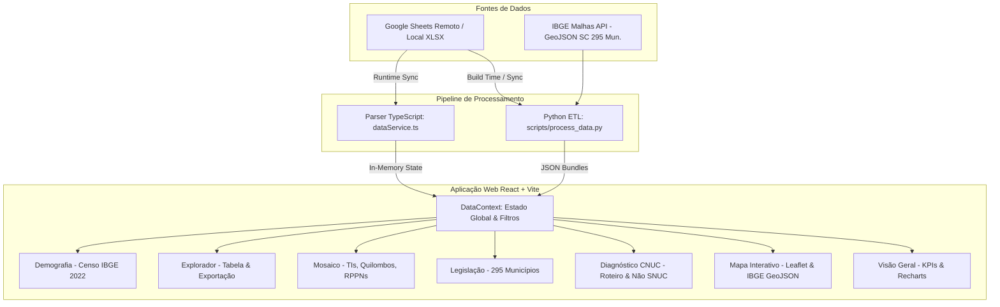
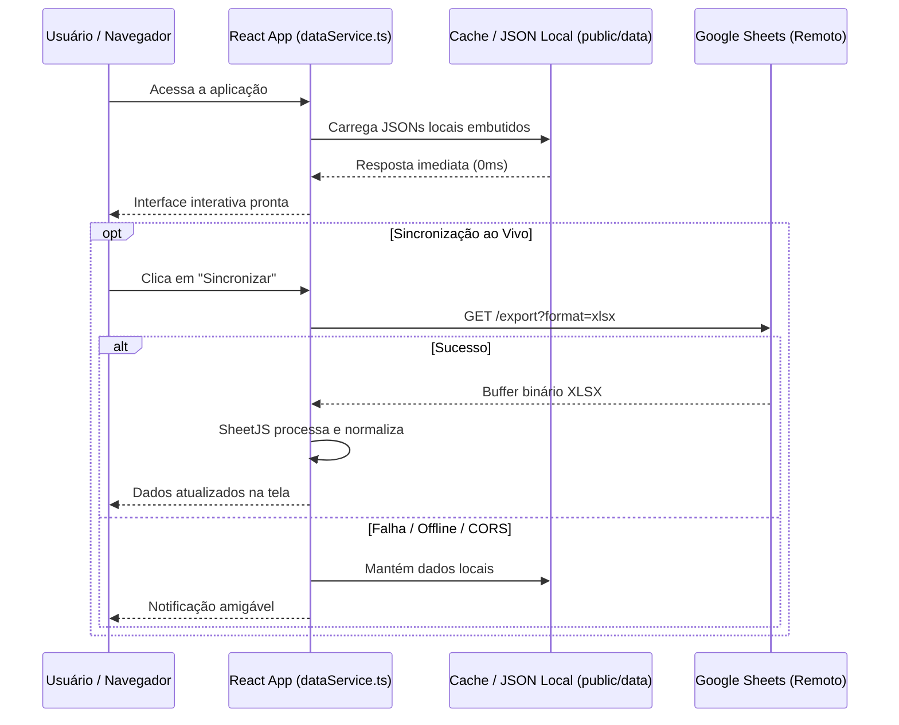

# 🏛️ Arquitetura do Sistema: Painel de UCs de Santa Catarina

Este documento descreve a arquitetura técnica, o fluxo de dados, a estrutura de componentes e as decisões de design da aplicação web analítica do **Painel de Unidades de Conservação de Santa Catarina**.

---

## 📐 Visão Geral da Arquitetura



---

## 📂 Estrutura de Diretórios

```
d:/Projetos/UCs
├── 📁 data_processed/            # Datasets JSON gerados pelo pipeline ETL (backup)
├── 📁 data_raw/                  # Arquivos brutos de entrada (Excel, IBGE, GeoJSON base)
│   ├── UCs de SC-completo.xlsx
│   ├── downloaded_from_gsheets.xlsx
│   ├── ibge_municipios_sc.json
│   ├── sc_municipios.geojson
│   └── sc_municipios_centroids.json
├── 📁 docs/                      # Build estático puro servido pelo GitHub Pages
├── 📁 dist/                      # Pasta de build de produção gerada pelo Vite
├── 📁 public/
│   ├── 📁 data/                  # Datasets JSON e GeoJSON embutidos consumidos pela SPA
│   │   ├── ucs.json
│   │   ├── roteiro.json
│   │   ├── nao_snuc.json
│   │   ├── legislacao_municipal.json
│   │   ├── rppns.json
│   │   ├── terras_indigenas.json
│   │   ├── quilombolas.json
│   │   ├── legislacao_estadual.json
│   │   ├── populacao_mesorregiao.json
│   │   ├── summary.json
│   │   ├── sc_mesorregioes.geojson
│   │   └── sc_municipios.geojson
│   └── favicon.svg
├── 📁 scripts/
│   └── process_data.py           # Script ETL Python para geração e normalização dos JSONs
├── 📁 src/
│   ├── 📁 components/
│   │   ├── 📁 dashboard/         # 🌲 Painel de Visão Geral (CNUC style)
│   │   ├── 📁 map/               # 🗺️ Mapa Leaflet com limites municipais e clusters
│   │   ├── 📁 diagnostico/       # 📋 Diagnóstico de regularização
│   │   ├── 📁 governanca/        # 🏛️ Matriz legislativa dos 295 municípios
│   │   ├── 📁 mosaico/           # 🌿 TIs, Quilombos e RPPNs
│   │   ├── 📁 explorador/        # 🔍 Tabela dinâmica e exportação Excel/CSV
│   │   ├── 📁 demografia/        # 📊 Cruzamento com Censo IBGE 2022
│   │   ├── 📁 layout/            # 🧭 Header, Navegação e Filtros Globais
│   │   └── 📁 modals/            # 📑 Modal de ficha técnica completa de UCs
│   ├── 📁 context/               # ⚡ DataContext e hook useData()
│   ├── 📁 services/              # 🔄 Conector Google Sheets, XLSX e Exportador
│   ├── 📁 types/                 # 📐 Interfaces TypeScript completas
│   ├── App.tsx                   # Componente raiz e roteamento de abas
│   ├── main.tsx                  # Ponto de entrada do React
│   └── index.css                 # Configurações de Tailwind e animações
├── 📁 tests/                     # Testes automatizados de interface E2E (Playwright)
├── 📄 vite.config.ts             # Configuração do Vite com base relativa
├── 📄 tailwind.config.js         # Tema de cores institucional floresta/oceano
└── 📄 package.json               # Dependências e scripts do projeto
```

---

## ⚡ Gerenciamento de Estado (`DataContext.tsx`)

O estado global da aplicação é centralizado através do React Context API e do hook personalizado `useData()`:

* **`data: AppData`**: Contém todos os registros carregados em memória (UCs, municípios, RPPNs, TIs, quilombos, legislação, estatísticas e GeoJSON).
* **`filters: FilterState`**: Objeto de filtros que sincroniza em tempo real:
  * `searchQuery`: busca textual ampla;
  * `esfera`: Municipal, Estadual, Federal;
  * `grupo`: Proteção Integral, Uso Sustentável;
  * `statusCnuc`: Cadastrada vs Fora do CNUC;
  * `planoManejo` e `conselhoGestor`: Sim vs Não;
  * `mesorregiao` e `categoria`.
* **`filteredUcs: UC[]`**: Lista memoizada (`useMemo`) resultante da aplicação dos filtros globais, garantindo renderização instantânea em < 5ms.
* **`selectedUc: UC | null`**: UC selecionada para exibição na modal de ficha técnica.
* **`selectedMunicipio: MunicipioLegislacao | null`**: Município selecionado no mapa ou na tabela.

---

## 🗺️ Camada Geoespacial & Mapas

1. **Malha Vetorial Oficial**: Utiliza o arquivo GeoJSON oficial do IBGE com os **295 municípios de Santa Catarina** (`sc_municipios.geojson`).
2. **Cálculo de Centroides**: Cada município e UC possui latitude/longitude associada, permitindo plotagem precisa de marcadores.
3. **Choropleth Dinâmico**: Os polígonos municipais são coloridos dinamicamente de acordo com a densidade de UCs ou o índice de governança ambiental.
4. **Camadas Alternáveis**: O usuário pode ativar/desativar camadas de *UCs do SNUC*, *RPPNs*, *Terras Indígenas* e *Comunidades Quilombolas*.

---

## 🔄 Fluxo de Sincronização e Resiliência Offline



---

## 🎨 Design System & Estilização

* **Paleta de Cores**:
  * `Emerald/Forest`: Verde institucional de conservação e florestas (#10b981, #047857).
  * `Sky/Ocean`: Azul oceano para áreas marinhas e esfera estadual (#0284c7).
  * `Purple`: Roxo para esfera federal e quilombos (#8b5cf6).
  * `Orange/Amber`: Laranja para terras indígenas e UCs com pendências (#f97316).
* **Tipografia**: Família `Inter` para máxima legibilidade de números e tabelas.
* **Dark Mode**: Suporte nativo classe `dark` do Tailwind sincronizado com `localStorage`.
